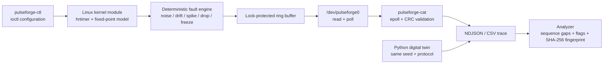

# PulseForge

[](https://github.com/Jimmy-Xi/pulseforge/actions/workflows/ci.yml)
[](LICENSE)
[](pyproject.toml)

**A deterministic, fault-injectable Linux telemetry device with a bit-exact Python digital twin.**

PulseForge creates `/dev/pulseforge0` without physical hardware. The kernel module emits a synthetic sensor waveform, injects reproducible failures, buffers samples in the kernel, and exposes them through a pollable character-device ABI. A C collector consumes frames with `epoll`; a dependency-free Python reference model can reproduce and analyze the same incident on any computer.

> Built as a portfolio-grade embedded systems project: kernel programming, stable UAPI design, asynchronous I/O, deterministic fault injection, data integrity, test automation and CI are exercised in one repository.

## What makes it different

- **Reproducible failures:** drops, spikes, freezes, noise and drift are derived from a `uint32` seed. A failure can be replayed instead of merely described.
- **Incident fingerprints:** every trace has a SHA-256 fingerprint. Matching fingerprints prove that configuration, seed and frame order produced the same incident.
- **Bit-exact digital twin:** the Linux driver and Python simulator use the same PRNG, fixed-point signal model, status flags, CRC-32 and 32-byte frame layout.
- **No hardware dependency:** the complete reference path runs on Windows, macOS and Linux; the kernel path runs on any recent Linux VM or PC.
- **Observable overload:** a full kernel ring drops the oldest frame, increments an overrun counter and marks the replacement frame with `PF_STATUS_OVERRUN`.

## Architecture



The shared ABI is defined once in [`include/pulseforge_uapi.h`](include/pulseforge_uapi.h). See [`docs/architecture.md`](docs/architecture.md) for invariants and design decisions.

## Quick start: digital twin

The simulator has no runtime dependencies.

```bash
python -m pip install -e .
pulseforge generate \
  --attempts 1000 \
  --seed 0xC0FFEE \
  --spike-every 97 \
  --drop-every 101 \
  --freeze-every 211 \
  --drift-ppm 40 \
  --output incident.ndjson

pulseforge analyze incident.ndjson
```

`generate` writes frames to NDJSON and prints the exact configuration, counters and fingerprint to stderr. Run the command again with the same arguments to obtain the same bytes and fingerprint.

## Quick start: Linux device

Prerequisites: a C compiler, GNU Make, and headers for the running kernel.

```bash
make userspace
make kernel
sudo insmod kernel/pulseforge.ko ring_depth=4096

# Change only the requested fields; the remaining configuration is preserved.
sudo userspace/pulseforge-ctl \
  --period-us 1000 \
  --spike-every 97 \
  --drop-every 101 \
  --freeze-every 211 \
  --seed 0xC0FFEE

sudo userspace/pulseforge-cat --count 1000 > incident.ndjson
sudo userspace/pulseforge-ctl --stats
python -m pulseforge_sim analyze incident.ndjson

sudo rmmod pulseforge
```

Use `--csv` with `pulseforge-cat` for spreadsheet or plotting workflows. A `--count 0` collector runs continuously.

## Failure model

| Control | Behavior | Evidence |
|---|---|---|
| `noise_milli` | Deterministic uniform additive noise | Signal value and fingerprint |
| `drift_ppm` | Linear fixed-point sensor drift | Increasing deviation from the triangle baseline |
| `spike_every` | Adds `3 × amplitude` every Nth attempt | `PF_STATUS_SPIKE` and spike counter |
| `drop_every` | Omits every Nth attempted sample | Sequence gap and drop counter |
| `freeze_every` | Repeats the last delivered value | `PF_STATUS_FREEZE` and freeze counter |
| Ring saturation | Evicts the oldest unread frame | `PF_STATUS_OVERRUN` and overrun counter |

An *attempt* always advances the deterministic PRNG and device sequence. This keeps the post-failure stream reproducible even when frames are dropped.

## Protocol

Every frame is exactly 32 bytes:

| Offset | Field | Type | Meaning |
|---:|---|---|---|
| 0 | `device_time_ns` | `uint64` | Deterministic device time |
| 8 | `sequence` | `uint64` | Attempt sequence; gaps expose drops |
| 16 | `signal_milli` | `int32` | Fixed-point signal value |
| 20 | `temperature_milli` | `int32` | Derived temperature channel |
| 24 | `status` | `uint32` | Spike, freeze and overrun flags |
| 28 | `crc32` | `uint32` | IEEE CRC-32 over bytes 0–27 |

The ABI is guarded by compile-time and unit-test size checks. Details are in [`docs/protocol.md`](docs/protocol.md).

## Verification

```bash
make test
make benchmark
```

The CI pipeline performs three independent checks:

1. Runs the Python protocol, model and CLI tests on Python 3.10, 3.12 and 3.14.
2. Builds both C utilities with `-Wall -Wextra -Wpedantic -Werror` and runs `cppcheck`.
3. Builds the out-of-tree kernel module against Ubuntu generic kernel headers.

Reference result on a Windows 11 laptop with Python 3.14:

- 250,000 attempted samples in 2.56 seconds.
- 97,780 attempts/second.
- 247,525 delivered frames under simultaneous spike/drop/freeze injection.
- Stable fingerprint: `ff4f4946f67c8bd0d6299d63457c25270727ba35240ad597529427f302c0f40b`.

Benchmark results depend on CPU and Python version; the fingerprint does not.

## Repository map

```text
kernel/       Linux misc character-device driver
userspace/    epoll collector and ioctl control utility in C
include/      stable shared userspace/kernel ABI
src/          cross-platform Python digital twin and analyzer
tests/        deterministic model, protocol and CLI tests
tools/        dependency-free benchmark
docs/         architecture, protocol, roadmap and resume notes
```

## Roadmap

Planned extensions include a QEMU PCI/MMIO backend, mmap zero-copy transport, eBPF latency probes, property-based cross-backend conformance tests and a live monitoring dashboard. See [`docs/roadmap.md`](docs/roadmap.md).

## Resume material

Ready-to-adapt Chinese and English bullet points, interview prompts and metric guidance are provided in [`docs/resume.md`](docs/resume.md). Replace reference measurements with results from the machine used in your own demonstration.

## License

MIT. This project is an educational virtual device; it is not a production safety or medical sensor.

